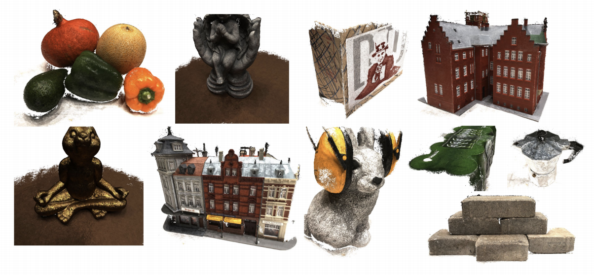

# UCSNet
### Deep Stereo using Adaptive Thin Volume Representation with Uncertainty Awareness, CVPR 2020. (<font color='red'>Oral Presentation</font>)
## Introduction
[UCSNet](https://arxiv.org/abs/1911.12012) is a learning-based framework for multi-view stereo (MVS). If you find this project useful for your research, please cite: 

<!--```
@misc{1911.12012,
Author = {Shuo Cheng and Zexiang Xu and Shilin Zhu and Zhuwen Li and Li Erran Li and Ravi Ramamoorthi and Hao Su},
Title = {Deep Stereo using Adaptive Thin Volume Representation with Uncertainty Awareness},
Year = {2019},
Eprint = {arXiv:1911.12012},
}
```
-->


```
@inproceedings{cheng2020deep,
  title={Deep stereo using adaptive thin volume representation with uncertainty awareness},
  author={Cheng, Shuo and Xu, Zexiang and Zhu, Shilin and Li, Zhuwen and Li, Li Erran and Ramamoorthi, Ravi and Su, Hao},
  booktitle={Proceedings of the IEEE/CVF Conference on Computer Vision and Pattern Recognition},
  pages={2524--2534},
  year={2020}
}
```

reconstruction results on DTU dataset:



## How to Use

### Environment
* python 3.6 (Anaconda)
* ``pip install -r requirements.txt``

### Reproducing Results

#### Compute Depth:
* Download pre-processed testset:  [Tanks and Temples](https://drive.google.com/open?id=12pvZ8nksx4yNBU1EN_vK6-2PNi7qyLmI) and [DTU](https://drive.google.com/open?id=1Mfx1oDoAzPbiqfseD8r02czPaNjUoUMJ). Each dataset should be organized as the following:

```
root_directory
├──scan1 (scene_name1)
├──scan2 (scene_name2)    
	├── images
	│   ├── 00000000.jpg       
	│   ├── 00000001.jpg       
	│   └── ...                
	├── cams                   
	│   ├── 00000000_cam.txt   
	│   ├── 00000001_cam.txt   
	│   └── ...                
	└── pair.txt               
```

* In ``scripts/test_on_dtu.sh`` or ``scripts/test_on_tanks.sh``, set `root_path` to dataset root directory, set `save_path` to your directory
* Test on GPU by running ``bash scripts/test_on_dtu.sh`` or ``bash scripts/test_on_tanks.sh``
* For testing your own data, please organize your dataset in the same way, and generate the data list for the scenes you want to test. View selection is very crutial for multi-view stereo. For each scene, you may also need to implement the view selection in ``pair.txt``:

```
TOTAL_IMAGE_NUM
IMAGE_ID0                       # index of reference image 0 
10 ID0 SCORE0 ID1 SCORE1 ...    # 10 best source images for reference image 0 
IMAGE_ID1                       # index of reference image 1
10 ID0 SCORE0 ID1 SCORE1 ...    # 10 best source images for reference image 1 
...
``` 
#### Depth Fusion:
* Download the modified [fusibile](https://github.com/kysucix/fusibile): `git clone https://github.com/YoYo000/fusibile`
* Install by `cmake .` and `make`
* In ``scripts/fuse_dtu.sh`` or ``bash scripts/fuse_tanks.sh``, set ``exe_path`` to executable fusibile path, set ``root_path`` to the directory that contain the test results, set ``target_path`` to where you want to save the point clouds.
* Fusing by running ``bash scripts/fuse_dtu.sh`` or ``bash scripts/fuse_tanks.sh``


Note: For DTU results, the fusion is performed on an NVIDIA GTX 1080Ti. For Tanks and Temple results, the fusion is performed on an NVIDIA P6000, as fusibile requires to read in the depth maps all in once, you may need a GPU with memory around 20GB. 
You can decrease the depth resolution in previous computing step or try [our implementation](https://github.com/touristCheng/DepthFusion) for depth fusion

### Training
* Install NVIDIA [apex](https://github.com/NVIDIA/apex) for using Synchronized Batch Normalization
* Download pre-processed DTU [training data](https://drive.google.com/file/d/1eDjh-_bxKKnEuz5h-HXS7EDJn59clx6V/view) from MVSNet, and download our rendered full resolution [ground-truth](https://drive.google.com/file/d/1krVT3FMfP3M7qtYRN9tn358a1YnXL7KQ/view?usp=sharing). Place the ground-truth in root directory, the train set need to be organized as:

```
root_directory
├──Cameras
├──Rectified
├──Depths_4
└──Depths  
```
* In ``scripts/train.sh``, set ``root_path`` to root directory, set ``num_gpus`` to the number of GPU on a machine (We use 8 1080Ti in our experiments).
* Training:  ``bash scripts/train.sh``


## Acknowledgements
[UCSNet](https://arxiv.org/abs/1911.12012) takes the [MVSNet](https://arxiv.org/abs/1804.02505) as its backbone. Thanks to Yao Yao for opening source of his excellent work, thanks to Xiaoyang Guo for his PyTorch implementation [MVSNet_pytorch](https://github.com/xy-guo/MVSNet_pytorch).